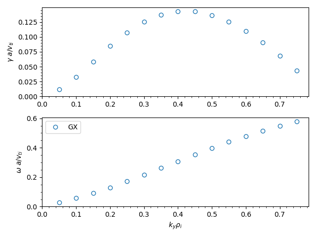

.. _quicklin:

Running your first linear simulation
++++++++++++++++++++++++++++++++++++

In this tutorial we set up a linear ion-temperature-gradient (ITG) instability calculation using a circular Miller geometry with Cyclone-base-case-like parameters and adiabatic electrons.

**Disclaimer**: GX is optimized for `nonlinear` calculations, not necessarily linear ones. Other gyrokinetic codes may be better-suited for some linear studies, which could require sharp velocity-space resolution and/or highly-accurate collision operators.

Input file
----------

The :doc:`input file <inputFiles/itg_miller_adiabatic_electrons>` for this case is included in the GX repository in ``benchmarks/linear/ITG/itg_miller_adiabatic_electrons.in``.
All GX input files consist of several blocks. 

Dimensions
==========

The ``[Dimensions]`` block controls the number of grid-points/spectral basis functions in each dimension, and the number of evolved kinetic species.

.. code-block:: toml

  [Dimensions]
   ntheta = 32            # number of points along field line (theta) per 2pi segment    
   nperiod = 2            # number of 2pi segments along field line is 2*nperiod-1
   nky = 16               # number of (de-aliased) fourier modes in y
   nkx = 1                # number of (de-aliased) fourier modes in x
  
   nhermite = 48          # number of hermite moments (v_parallel resolution)
   nlaguerre = 16         # number of laguerre moments (mu B resolution)
   nspecies = 1           # number of evolved kinetic species 
                          # (adiabatic electrons don't count towards nspecies)

Here, we have set the number of points along the field line per :math:`2\pi` segment to be ``ntheta = 32``, and we use ``nperiod = 2`` which gives 3 segments. This means the entire :math:`\theta` domain spans :math:`[-3\pi,3\pi]`, and we will have 96 total :math:`\theta` grid-points. Note that setting ``nperiod > 1`` is only recommended for linear calculations.

The parameters ``nky`` and ``nkx`` control the number of (de-aliased) Fourier modes in the perpendicular dimensions, with :math:`x` the radial coordinate and :math:`y` the binormal coordinate. Specifying ``nky = 16`` means we will evolve 16 :math:`k_y` Fourier modes in this calculation. Typically, for linear instability calculations the fastest growing modes will have :math:`k_x = 0`, so we use ``nkx = 1``. 

The parameters ``nhermite`` and ``nlaguerre`` control the velocity-space resolution for the calculation. Since GX uses a spectral velocity space formulation, the :math:`v_\parallel` resolution is controlled by the number of Hermite moments (``nhermite``), and the :math:`\mu B` resolution is controlled by the number of Laguerre moments (``nlaguerre``). 

The parameter ``nspecies`` controls the number of evolved kinetic species. Here we are using kinetic ions and adiabatic electrons, so we set ``nspecies = 1`` (adiabatic electrons aren't a kinetic species and don't count towards ``nspecies``).

Domain
======

The ``[Domain]`` block controls the size of the domain and the boundary conditions.

.. code-block:: toml

  [Domain]
   y0 = 20.0              # controls box length in y (in units of rho_ref) and minimum ky, 
                          # so that ky_min*rho_ref = 1/y0 
   boundary = "linked"    # use twist-shift boundary conditions along field line

The parameter ``y0`` is related to the box length in the binormal coordinate :math:`y` via :math:`L_y = 2\pi y_0`, where these lengths are normalized to the reference gyroradius. This effectively sets the minimum :math:`k_y` in the box, given by :math:`k_{y\, \mathrm{min}} \rho_\mathrm{ref} = 1/y_0 = 0.05`. Together with ``nky = 16``, this means we will have a range of Fourier modes with :math:`k_y = [0, 0.05, 0.1, ..., 0.5, 0.55]` and :math:`k_x = 0`.

We use twist-shift boundary conditions along the (extended) field line by specifying ``boundary = "linked"``. 

Physics
=======

The ``[Physics]`` block controls what physics is included in the simulation.

.. code-block:: toml

  [Physics]
   beta = 0.0     	       # reference normalized pressure, beta = n_ref T_ref / ( B_ref^2 / (8 pi))
   nonlinear_mode = false      # this is a linear calculation

Since this is an electrostatic calculation with adiabatic electrons we set the plasma reference beta ``beta = 0.0``, which turns off electromagnetic effects. We also make this a linear calculation by setting ``nonlinear_mode = false``.

Time
=======

The ``[Time]`` block controls the timestepping scheme and parameters.

.. code-block:: toml

  [Time]
   dt = 0.005             # timestep size (in units of L_ref/vt_ref)
   nstep  = 30000         # number of timesteps
   scheme = "sspx3"       # use SSPx3 timestepping scheme

Initialization
==============

The ``[Initialization]`` block controls the initial conditions. 

.. code-block:: toml

  [Initialization]
   ikpar_init = 0                  # parallel wavenumber of initial perturbation
   init_field = "density"          # initial condition set in density
   init_amp = 1.0e-10              # amplitude of initial condition

Here we set up an initial condition that is constant along the field line (``ikpar_init = 0``) with initial perturbation amplitude ``init_amp = 1.0e-10`` in the density moment (``init_field = "density"``). By default, a random initial condition satisfying these constraints is used.
  
Geometry
========

The ``[Geometry]`` block controls the simulation geometry.

.. code-block:: toml

  [Geometry]
   igeo = 1                        # use Miller geometry, and read geometry coefficients from "eik"-style text file
   geofile = "itg_miller.eik.out"  # name of geometry file
   rhoc = 0.5                      # flux surface label, r/a
   Rmaj = 2.77778                  # major radius of center of flux surface, normalized to L_ref
   R_geo = 2.77778                 # major radius of magnetic field reference point, normalized to L_ref (i.e. B_t(R_geo) = B_ref)
   qinp = 1.4                      # safety factor
   shat = 0.8                      # magnetic shear
   shift = 0.0                     # shafranov shift
   akappa = 1.0                    # elongation of flux surface
   akappri = 0.0                   # radial gradient of elongation
   tri = 0.0                       # triangularity of flux surface 
   tripri = 0.0                    # radial gradient of triangularity
   betaprim = 0.0                  # radial gradient of beta

When ``igeo = 1``, GX reads the geometry file specified by ``geofile`` to set up a Miller equilibrium geometry for the calculation. When the Miller parameters are specified in the input file (as they are here), this "eik"-style geometry file can be created in a pre-processing step using the ``geometry_modules/miller/gx_geo.py`` script in the GX repository. From the directory containing the input file, this can be done by executing

.. code-block:: bash

  python ../../../geometry_modules/miller/gx_geo.py itg_miller_adiabatic_electrons.in itg_miller.eik.out

The resulting ``itg_miller.eik.out`` file can now be read by GX to initialize the Miller geometry for the calculation.

Species
=======

The ``[species]`` block specifies parameters like charge, mass, and gradients of each species.

.. code-block:: toml

  # it is okay to have extra species data here; only the first nspecies elements of each item are used
  [species]
   z     = [ 1.0,      -1.0     ]         # charge (normalized to Z_ref)
   mass  = [ 1.0,       2.7e-4  ]         # mass (normalized to m_ref)
   dens  = [ 1.0,       1.0     ]         # density (normalized to dens_ref)
   temp  = [ 1.0,       1.0     ]         # temperature (normalized to T_ref)
   tprim = [ 2.49,       0.0     ]        # temperature gradient, L_ref/L_T
   fprim = [ 0.8,       0.0     ]         # density gradient, L_ref/L_n
   vnewk = [ 0.0,       0.0     ]         # collision frequency
   type  = [ "ion",  "electron" ]         # species type

Note that species parameters ``z, mass, dens, temp`` are normalized to the corresponding value of the reference species, which can be chosen arbitrarily. Here we only have a single species, so we simply choose the ions as the reference species, meaning :math:`z_i = Z_i/Z_\mathrm{ref} = 1.0` etc. Also, note that the species tables can have extra species data; only the first ``nspecies`` elements will be used.
  
Boltzmann
==========

The ``[Boltzmann]`` block sets up a Boltzmann species. Here we use Boltzmann (adiabatic) electrons.

.. code-block:: toml

  [Boltzmann]
   add_Boltzmann_species = true    # use a Boltzmann species
   Boltzmann_type = "electrons"    # the Boltzmann species will be electrons
   tau_fac = 1.0                   # temperature ratio, T_i/T_e
  
Dissipation
===========

The ``[Dissipation]`` block controls numerical dissipation parameters.

.. code-block:: toml

  [Dissipation]
   closure_model = "none"          # no closure assumptions (just truncation)
   hypercollisions = true          # use hypercollision model
   nu_hyper_m = 0.5                # coefficient of hermite hypercollisions
   p_hyper_m = 6                   # power of hermite hypercollisions
   nu_hyper_l = 0.5                # coefficient of laguerre hypercollisions
   p_hyper_l = 6                   # power of laguerre hypercollisions

We do not make any closure assumptions (``closure_model = "none"``), instead opting for a simple truncation of the moment series. In lieu of closures, hypercollisions can provide the necessary dissipation at small scales in velocity space (large hermite and laguerre index). Here we use a hypercollision operator of the form

.. math::
  \nu_\mathrm{hyp}G_{\ell,m} &= [\texttt{nu_hyper_m}M(m/M)^\texttt{p_hyper_m} + \texttt{nu_hyper_l}L(\ell/L)^\texttt{p_hyper_l}] G_{\ell, m} \\
                    &= [0.5M(m/M)^6 + 0.5L(\ell/L)^6] G_{\ell, m}

where :math:`L =` ``nlaguerre`` and :math:`M =` ``nhermite``.
  
Diagnostics
===========

The ``[Diagnostics]`` block controls the diagnostic quantities that are computed and written to the NetCDF output file.

.. code-block:: toml

  [Diagnostics]
   nwrite = 1000                   # write diagnostics every 1000 timesteps
   omega  = true                   # compute and write growth rates and frequencies

  # spectra of W = |G_lm|**2
  [Wspectra]
   species          = false
   hermite          = false
   laguerre         = false
   hermite_laguerre = true          # W(l,m) (summed over kx, ky, z)
   kx               = false
   ky               = true          # W(ky) (summed over kx, z, l, m)
   kxky             = false
   z                = false
  
  # spectra of P = ( 1 - Gamma_0(b_s) ) |Phi|**2
  [Pspectra]
   species          = false
   kx               = false
   ky               = true         # P(ky) (summed over kx, z)
   kxky             = false
   z                = true         # P(z) (summed over kx, ky)

For linear calculations, we can request to compute and write growth rates and real frequencies by using ``omega = true``. Additionally, various spectra can be computed as specified by the ``[Wspectra]`` and ``[Pspectra]`` blocks.

Plotting the results
--------------------

Growth Rates & Frequencies
==========================

We can plot the growth rates and real frequencies using the following python script:

.. code-block:: python
  
  import numpy as np
  import matplotlib.pyplot as plt
  from matplotlib.ticker import AutoMinorLocator
  from netCDF4 import Dataset

  fig, (ax1, ax2) = plt.subplots(2)

  # read gx data
  stem = "itg_miller_adiabatic_electrons"
  data = Dataset("%s.nc" % stem, mode='r')
  t = data.variables['time'][:]
  ky = data.variables['ky'][1:]
  omegas = data.groups['Special'].variables['omega_v_time'][:,1:,0,0]
  gams = data.groups['Special'].variables['omega_v_time'][:,1:,0,1]
  omavg = np.mean(omegas[int(len(t)/2):, :], axis=0)
  gamavg = np.mean(gams[int(len(t)/2):, :], axis=0)

  # plot growth rates and frequencies
  ax1.plot(ky, gamavg, 'o', fillstyle='none')
  ax2.plot(ky, omavg, 'o', fillstyle='none', label='GX')

  ax1.xaxis.set_minor_locator(AutoMinorLocator())
  ax2.xaxis.set_minor_locator(AutoMinorLocator())
  
  ax1.yaxis.set_minor_locator(AutoMinorLocator())
  ax2.yaxis.set_minor_locator(AutoMinorLocator())
  
  ax1.set_xlim(left=0)
  ax2.set_xlim(left=0)
  ax1.set_ylim(bottom=0)
  ax2.set_ylim(bottom=0)
  ax1.set_ylabel(r'$\gamma\ a / v_{ti}$')
  ax2.set_ylabel(r'$\omega\ a / v_{ti}$')
  ax2.set_xlabel(r'$k_y \rho_i$')
  ax2.legend()
  plt.tight_layout()
  plt.show()
 

