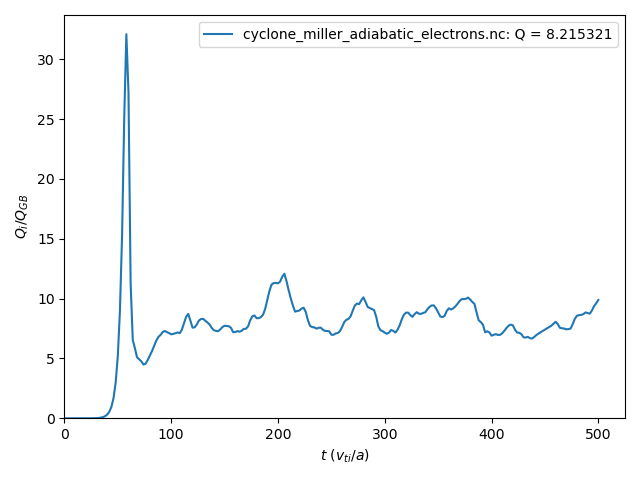

.. _quicknl:

Running your first nonlinear simulation
+++++++++++++++++++++++++++++++++++++++

In this tutorial we set up a nonlinear ITG turbulence calculation using a circular tokamak geometry given by a Miller equilibrium with Cyclone-base-case-like parameters and adiabatic electrons.

.. contents::

Setting up the input file
-------------------------

The :doc:`input file <inputFiles/nl_miller_adiabatic_electrons>` for this case is included in the GX repository in ``benchmarks/nonlinear/cyclone/cyclone_miller_adiabatic_electrons.in``.

The input file for this nonlinear case is similar to the :ref:`linear <quicklin>` example, but we will highlight key differences below. For more details about input parameters, see :ref:`input_file`.

Dimensions
==========

.. code-block:: toml

  [Dimensions]
   ntheta = 24            # number of points along field line (theta) per 2pi segment    
   nperiod = 1            # number of 2pi segments along field line is 2*nperiod-1
   ny = 64                # number of real-space grid-points in y
   nx = 192               # number of real-space grid-points in x
  
   nhermite = 8           # number of hermite moments (v_parallel resolution)
   nlaguerre = 4          # number of laguerre moments (mu B resolution)
   nspecies = 1           # number of evolved kinetic species (adiabatic electrons don't count towards nspecies)

Unlike in the :ref:`linear <lindims>` calculation where we set ``nkx`` and ``nky``, for a nonlinear calculation it is recommended to set the perpendicular resolution using ``nx`` and ``ny``. These are the number of real-space grid-points used in the radial and binormal coordinates when computing the nonlinear term pseudo-spectrally. Because of the need to prevent aliasing of Fourier modes, the number of evolved Fourier modes is less: ``nkx = 1 + 2*(nx-1)/3 = 64`` and ``nky = 1 + (ny-1)/3 = 22``. 

Further, it is recommended to set ``nperiod = 1`` for nonlinear calculations; when ``nx>1``, extension of modes along the field line is captured by twist-shift boundary conditions that link together several modes on an extended :math:`\theta` domain. 

We have also lowered the velocity resolution for this nonlinear calculation compared to the linear one. This is done mainly so that this example runs quickly (< 5 min on a single A100 GPU). Nevertheless, the calculation is still quite accurate even at this fairly low velocity resolution due to GX's choice of velocity-space coordinates and spectral approach.

Domain
======

.. code-block:: toml

  [Domain]
   y0 = 28.2              # controls box length in y (in units of rho_ref) and minimum ky, so that ky_min*rho_ref = 1/y0 
   boundary = "linked"    # use twist-shift boundary conditions along field line
  
The ``[Domain]`` group here is similar to the one from the :ref:`linear <lindom>` calculation. Here, setting the binormal box length with ``y0=28.2`` means that the minimum binormal wavenumber will be :math:`k_{y\, \mathrm{min}}\rho_i = \texttt{1/y0} = 0.0355`, and the maximum binormal wavenumber will be :math:`k_{y\,\mathrm{max}}\rho_i = \texttt{nky/y0} = 0.78`. What about the radial box length? By default (when there is finite magnetic shear), the radial box length is set to be approximately the same as the binormal box length. It usually cannot be exactly equal because the radial box length must be specially quantized so that the twist-shift (``"linked"``) boundary condition can be applied appropriately.

Physics
=======

.. code-block:: toml

  [Physics]
   beta = 0.0                      # reference normalized pressure, beta = n_ref T_ref / ( B_ref^2 / (8 pi))
   nonlinear_mode = true           # this is a nonlinear calculation

To make this a nonlinear calculation we must set ``nonlinear_mode = true``.

Time
=======

.. code-block:: toml

  [Time]
   t_max = 400.0         # end time (in units of L_ref/vt_ref)
   cfl = 0.9             # safety cushion factor on timestep
   scheme = "rk3"        # use RK3 timestepping scheme

Running for ``t_max = 400.0`` time units should be enough to get a converged heat flux. 

Initialization
==============

.. code-block:: toml

  [Initialization]
   ikpar_init = 0                  # parallel wavenumber of initial perturbation
   init_field = "density"          # initial condition set in density
   init_amp = 1.0e-3               # amplitude of initial condition

The ``[Initialization]`` block is the same as in the :ref:`linear <lininit>` case, except that the initial amplitude of random perturbations (``init_amp``) is larger here to shorten the linear phase of the simulation.

Geometry
========

.. code-block:: toml

  [Geometry]
   geo_option = "miller"           # use Miller geometry
   rhoc = 0.5                      # flux surface label, r/a
   Rmaj = 2.77778                  # major radius of center of flux surface, normalized to L_ref
   R_geo = 2.77778                 # major radius of magnetic field reference point, normalized to L_ref (i.e. B_t(R_geo) = B_ref)
   qinp = 1.4                      # safety factor
   shat = 0.8                      # magnetic shear
   shift = 0.0                     # shafranov shift
   akappa = 1.0                    # elongation of flux surface
   akappri = 0.0                   # radial gradient of elongation
   tri = 0.0                       # triangularity of flux surface 
   tripri = 0.0                    # radial gradient of triangularity
   betaprim = 0.0                  # radial gradient of beta

As in the :ref:`linear <lingeo>` case, we specify a Miller local equilibrium geometry corresponding to unshifted circular flux surfaces. 

Species
=======

.. code-block:: toml

  # it is okay to have extra species data here; only the first nspecies elements of each item are used
  [species]
   z     = [ 1.0,      -1.0     ]         # charge (normalized to Z_ref)
   mass  = [ 1.0,       2.7e-4  ]         # mass (normalized to m_ref)
   dens  = [ 1.0,       1.0     ]         # density (normalized to dens_ref)
   temp  = [ 1.0,       1.0     ]         # temperature (normalized to T_ref)
   tprim = [ 2.49,       0.0     ]        # temperature gradient, L_ref/L_T
   fprim = [ 0.8,       0.0     ]         # density gradient, L_ref/L_n
   vnewk = [ 0.0,       0.0     ]         # collision frequency
   type  = [ "ion",  "electron" ]         # species type

Same as the :ref:`linear <linspec>` case.
  
Boltzmann
==========

.. code-block:: toml

  [Boltzmann]
   add_Boltzmann_species = true    # use a Boltzmann species
   Boltzmann_type = "electrons"    # the Boltzmann species will be electrons
   tau_fac = 1.0                   # temperature ratio, T_i/T_e

Same as the :ref:`linear <linboltz>` case.

Dissipation
===========

.. code-block:: toml

  [Dissipation]
   closure_model = "none"          # no closure assumptions (just truncation)
   hypercollisions = true          # use hypercollision model
   nu_hyper_m = 0.5                # coefficient of hermite hypercollisions
   p_hyper_m = 6                   # power of hermite hypercollisions
   nu_hyper_l = 0.5                # coefficient of laguerre hypercollisions
   p_hyper_l = 6                   # power of laguerre hypercollisions
  
   hyper = true                    # use hyperviscosity
   D_hyper = 0.05                  # coefficient of hyperviscosity
   nu_hyper = 2                    # power of hyperviscosity

In addition to ``hypercollisions``, we also include hyperviscosity (``hyper=true``) in this nonlinear simulation, which provides dissipation at the grid scale in the :math:`x` and :math:`y` dimensions. 
.. The hyperviscosity operator takes the form

.. .. math::
..   \nu_\mathrm{hyp}G_{\ell,m} &= \texttt{D_hyper}\left(\frac{k_x^2 + k_y^2}{k_{x\,\mathrm{max}}^2+k_{y\,\mathrm{max}}^2}\right)^\texttt{nu_hyper} G_{\ell,m} \\
                    &= 0.05\left(\frac{k_x^2 + k_y^2}{k_{x\,\mathrm{max}}^2+k_{y\,\mathrm{max}}^2}\right)^2 G_{\ell, m}

Diagnostics
===========

.. code-block:: toml

  [Diagnostics]
   nwrite = 100                    # write diagnostics every 100 timesteps
   fluxes = true                   # compute and write heat and particle fluxes
  
  [Wspectra]                       # spectra of W = |G_lm|**2
  species          = false
  hermite          = false
  laguerre         = false
  hermite_laguerre = true          # W(l,m) (summed over kx, ky, z)
  kx               = false
  ky               = true          # W(ky) (summed over kx, z, l, m)
  kxky             = false
  z                = false
  
  [Pspectra]                      # spectra of P = ( 1 - Gamma_0(b_s) ) |Phi|**2
  species          = false
  kx               = false
  ky               = true         # P(ky) (summed over kx, z)
  kxky             = false
  z                = true         # P(z) (summed over kx, ky)

  [Qspectra]                      # spectra of Q (heat flux)
  kx               = false
  ky               = true         # Q(ky) (summed over kx, z)
  kxky             = false
  z                = true         # Q(z) (summed over kx, ky)
  
For nonlinear simulations, a key set of diagnostics are the turbulent fluxes of particles and energy, which are made available by setting ``fluxes=true``. Note that when using a single kinetic species with a Boltzmann species, the particle flux will be zero.

Running the simulation
----------------------

To run the simulation from the ``benchmarks/nonlinear/cyclone`` directory, we can use

.. code-block:: bash

  ../../../gx cyclone_miller_adiabatic_electrons.in

This will generate an output file in NetCDF format called ``cyclone_miller_adiabatic_electrons.nc`` (in the same directory).

Plotting the results
--------------------

Heat flux
=========

We can plot the ion heat flux using a python script included in the ``post_processing`` directory. From the ``benchmarks/nonlinear/cyclone`` directory, this can be done using

.. code-block:: bash

  python ../../../heat_flux.py cyclone_miller_adiabatic_electrons.nc

